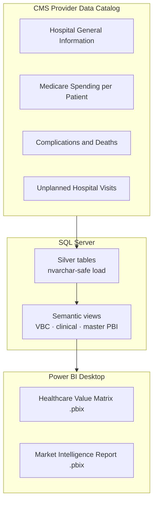
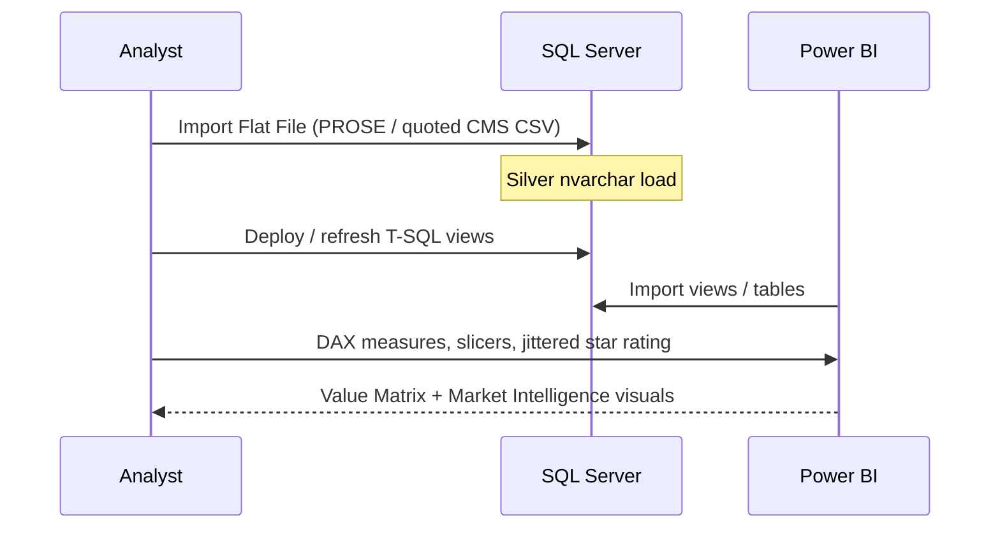

# Healthcare Market Intelligence — Architecture

**Last updated:** 2026-08-12  
**Type:** SQL Server + Power BI portfolio suite (complete)  
**Related:** [PORTFOLIO.md](../PORTFOLIO.md) · [PROJECT_PLAN.md](../PROJECT_PLAN.md) · [README.md](../README.md)

---

## Purpose

System design for the CMS hospital quality + Medicare spending analysis: how federal CSVs land in SQL Server, become semantic views, and feed a branded Power BI suite for value-based care / market expansion storytelling.

---

## System overview



---

## Layers

| Layer | Location | Role |
|-------|----------|------|
| **Raw** | `data/*.csv` | Official CMS hospital / spending / clinical extracts |
| **Silver** | SQL Server tables (local lab) | Wide `nvarchar` ingest to avoid truncation / shift |
| **Semantic** | `sql/*.sql` views | Business grain: high-cost/low-quality, state summary, clinical mortality/readmission, master PBI source |
| **Presentation** | `Market-Intelligence-Analysis/*.pbix` | Executive dashboards (1500px branded suite) |

---

## Request / analysis path (BI, not web)



There is **no public web runtime**. Delivery is SSMS + Power BI Desktop (optional future: Power BI Service embed).

---

## Semantic model (conceptual)

| View / artifact | Intent |
|-----------------|--------|
| High cost / low quality facilities | VBC targeting quadrant (spend vs star quality) |
| State market summary | Regional comparative performance |
| Clinical mortality / readmission | Outcomes joined to facility context |
| Master PBI hospital source | Single feed for KPI ribbon and suite pages |

**Join key:** `Facility_ID` (CMS facility identifier) across general info and spending / clinical sets.

**COL-style honesty:** CMS public metrics and survey vintages — not real-time claims or patient-level PHI.

---

## Hard problems solved (architecture-relevant)

| Problem | Design response |
|---------|-----------------|
| Facility names with internal commas | SSMS Import Flat File / PROSE quoted fields |
| 27k+ cells lost on strict numeric import | Silver `nvarchar` first; `TRY_CAST` in views |
| Star rating overplotting (integer bands) | DAX statistical jitter on star rating |
| Suite inconsistency | 1500px canvas, shared control bar measures, Dunleavy palette |

---

## Repo layout

```text
Healthcare-Market-Intelligence/
├── data/                          # CMS CSVs
├── sql/                           # Semantic views & PBI sources
├── Market-Intelligence-Analysis/  # .pbix suite + solution file
├── docs/ARCHITECTURE.md
├── PROJECT_PLAN.md
├── PORTFOLIO.md
├── AGENTS.md
└── README.md
```

---

## Tech stack

| Layer | Choice | Why |
|-------|--------|-----|
| Warehouse | SQL Server | Microsoft BI path; views + PBI |
| Ingest | SSMS Import Flat File | Messy CMS CSV quoting |
| Semantics | T-SQL views | Safe cast, Facility_ID joins |
| Viz | Power BI + DAX | Executive interactivity |
| Source | CMS federal datasets | Authoritative public data |

---

## File anchors

| Concern | Path |
|---------|------|
| Master PBI view SQL | `sql/03_create_master_pbi_view.sql` |
| Value matrix source | `sql/04_Value_Matrix_Dashboard_Source.sql` |
| Clinical views | `sql/ClinicalMortalityView.sql`, `ClinicalReadmissionView.sql` |
| High cost / low quality | `sql/CMSHighCostLowQuality.sql` |
| Reports | `Market-Intelligence-Analysis/*.pbix` |
